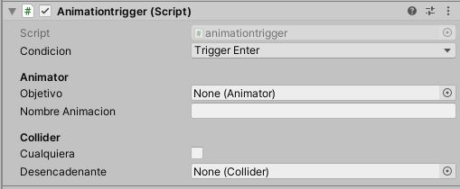

# Unity Scripts

#### Repositorio de scripts para Unity en C# desarrollados para los cursos del Área de Lenguajes Computarizados
----
## Scripts
* ### [Animation Trigger](files/animationtrigger.cs)
  
**Descripcion:** Dispara una animacion cuando un trigger de colision es detectado.

*Condicion:* Trigger Enter, Trigger Stay, Trigger Exit, Collision Enter.  
*Objetivo:* Componente Animator del objeto que contiene la animacion.  
*Nombre Animacion:* Nombre de la animacion a reproducir.  
*Cualquiera:* True o False, indica si el trigger es con cualquier elemento.  
*Desencadenante:* Componente Collider del objeto activador, en caso de que no sea cualquiera.

  
  
  
