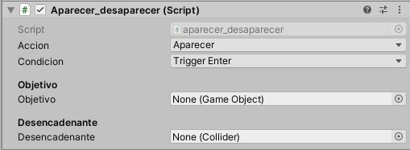
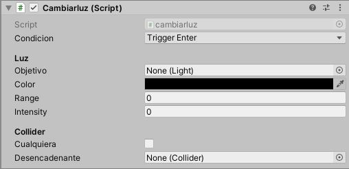
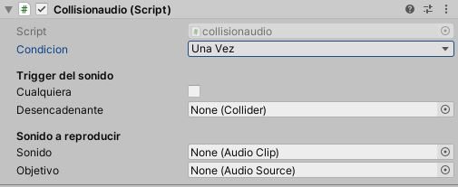

# Unity Scripts

#### Repositorio de scripts para Unity en C# desarrollados para los cursos del Área de Lenguajes Computarizados
----
## Scripts
* ### [Animation Trigger](files/animationtrigger.cs)
  
**Descripcion:** Dispara una animacion cuando un trigger de colision es detectado.

*Condicion:* Trigger Enter, Trigger Stay, Trigger Exit, Collision Enter.  
*Objetivo:* Componente Animator del objeto que contiene la animacion.  
*Nombre Animacion:* Nombre de la animacion a reproducir.  
*Cualquiera:* True o False, indica si el trigger es con cualquier elemento.  
*Desencadenante:* Componente Collider del objeto activador, en caso de que no sea cualquiera.  

* ### [Aparece / Desaparece](files/aparecer_desaparecer.cs)
  
**Descripcion:** Hace aparecer o desaparecer un elemento de la escena cuando un trigger de colision se dispara.  

*Accion:* Aparecer o Desaparecer  
*Condicion:* Trigger Enter, Trigger Stay, Trigger Exit, Collision Enter.  
*Objetivo:* Elemento que a Desaparecer / Aparecer  
*Desencadenante:* Componente Collider del objeto activador. 

* ### [Cambiar Luz](files/cambiarluz.cs)
  
**Descripcion:** Modifica las propiedades de una luz en la escena cuando un trigger de colision se dispara.  

*Condicion:* Trigger Enter, Trigger Stay, Trigger Exit, Collision Enter.  
*Objetivo:* Elemento luz a modificar.  
*Color:* Color de la luz a establecer.  
*Range:* Rando de la luz a establecer.    
*Intensity:* Intensidad de la luz a establecer.  
*Cualquiera:* True o False, indica si el trigger es con cualquier elemento.  
*Desencadenante:* Componente Collider del objeto activador, en caso de que no sea cualquiera.  

* ### [Disparar Audio](files/collisionaudio.cs)
  
**Descripcion:** Dispara un sonido al recibir una señal de trigger. 

*Condicion:* Una Vez (Reproduce el sonido solo la primera vez que colisiona), CadaVez (Reproduce el sonido desde el comienzo cada vez que hay colision), PorContacto (Reproduce el sonido mientras este en contacto con el objeto indicado).  
*Cualquiera:* True o False, indica si el trigger es con cualquier elemento.  
*Desencadenante:* Componente Collider del objeto activador, en caso de que no sea cualquiera.
*Sonido:* Archivo de sonido a reproducir.  
*Objetivo:* Fuente de sonido a utilizar para reproducir el archivo.

  
  
  
